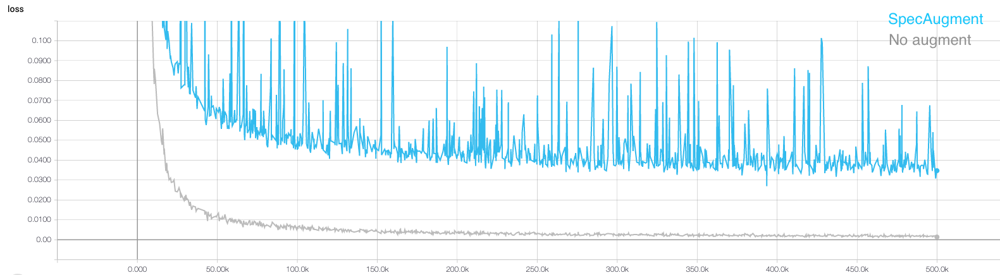
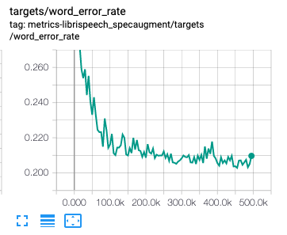
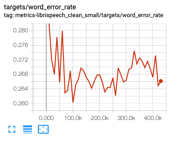

# SpecAugment

Implementation of [SpecAugment: A Simple Data Augmentation Method for Automatic Speech Recognition](https://arxiv.org/abs/1904.08779)

## Notes
* The paper introduces three techniques for augmenting speech data in speech recognition.
* They came from the observation that the spectrograms which often used as input can be treated as an image, so various image augmentation methods can be transplanted.
* I find the idea interesting.
* It covers three methods: time warping, frequency masking, and time masking.
* Details are clearly explained in the paper.
* While the first one, time warping, looks salient apparently, [Daniel](danielspark@google.com), the first author, told me that indeed the other two are much more important than time warping, so it can be ignored if necessary. (Thanks for the advice, Daniel!)
* In TensorFlow, I found that implementing time warping is tricky because the relevant code is based on the static shape of the melspectrogram tensor, which is not possible to get from the wave files of variable lengths.
* Reserving it for a future task, I test frequency / time masking on [Tensor2tensor](https://github.com/tensorflow/tensor2tensor)'s LibriSpeech Clean Small Task rather than the full set.
* With 4 GPUs, training (for 500K) seems to take more than a week.
* To compare the effect of specAugment, I also run a vanilla model.

## Script
```
echo "No specAugment"
# Set Paths
MODEL=transformer
HPARAMS=transformer_librispeech_v1

PROBLEM=librispeech_clean_small
DATA_DIR=data/no_spec
TMP_DIR=tmp
TRAIN_DIR=train/$PROBLEM

mkdir -p $DATA_DIR $TMP_DIR $TRAIN_DIR

# Generate data
t2t-datagen \
  --data_dir=$DATA_DIR \
  --tmp_dir=$TMP_DIR \
  --problem=$PROBLEM

# Train
t2t-trainer \
  --data_dir=$DATA_DIR \
  --problem=$PROBLEM \
  --model=$MODEL \
  --hparams_set=$HPARAMS \
  --output_dir=$TRAIN_DIR \
  --train_steps=500000 \
  --eval_steps=3 \
  --local_eval_frequency=5000 \ 
  --worker_gpu=4

echo "specAugment"
# Set Paths
PROBLEM=librispeech_specaugment
DATA_DIR=data/spec
TMP_DIR=tmp
TRAIN_DIR=train/$PROBLEM
USER_DIR=USER_DIR

mkdir -p $DATA_DIR $TMP_DIR $TRAIN_DIR

# Generate data
t2t-datagen \
  --data_dir=$DATA_DIR \
  --tmp_dir=$TMP_DIR \
  --problem=$PROBLEM

# Train
t2t-trainer \
  --t2t_usr_dir=$USER_DIR \
  --data_dir=$DATA_DIR \
  --problem=$PROBLEM \
  --model=$MODEL \
  --hparams_set=$HPARAMS \
  --output_dir=$TRAIN_DIR \
  --train_steps=500000 \
  --eval_steps=3 \
  --local_eval_frequency=5000 \ 
  --worker_gpu=4
```

## Results
### Training loss


* Currently, the base model reached almost 500K, while the specAugment model is still being trained.
* Augmentation seems to do harm on training loss. It is understandable and expected.

### Word Error Rate (SpecAugment (top) vs. No augmentation (bottom))




* The base model looks messy. The WER hangs around 26%, which is bad.
* The specAugment model looks better, and it is likely to keep improving. However, I don't think the WER will go down to 10%. 
